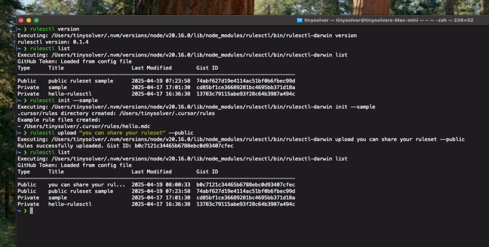

# rulesctl

Cursor Rules management tool using GitHub Gist


## Problem → Solution

We needed a tool to effectively manage and share Cursor Rules with other developers. rulesctl allows you to systematically store rules using GitHub Gist and share them selectively through public/private options.

## Usage

### Installation

You can install via NPM:

```bash
npm install -g rulesctl
```

### Authentication Setup

GitHub token is required for the following features:
- Uploading rules (public/private)
- Viewing my Gist list
- Searching rules by title
- Downloading private Gists

> **Note**: Token is not required when downloading public Gists by ID!

There are two ways to set up authentication:

1. Using environment variable (recommended)
```bash
export GITHUB_TOKEN="your_github_token"
# No need to run 'rulesctl auth' when using environment variable
```

2. Using the auth command
```bash
rulesctl auth  # Enter token at prompt
```

The token will be stored in JSON format in the `~/.rulesctl/config` file in your home directory when using the auth command.

> **Important**: Your Personal Access Token needs the following permissions:
> - Gist (read/write) permissions
> - repo permissions (for accessing file lists at https://github.com/PatrickJS/awesome-cursorrules/tree/main/rules-new)

For information on how to create a token, refer to the [GitHub official documentation](https://docs.github.com/en/authentication/keeping-your-account-and-data-secure/creating-a-personal-access-token).

### Getting Started

There are two ways to get started:

1. Start with example rules (recommended)
```bash
# Download shared example rules (no token required)
rulesctl download --gistid 74abf627d19e4114ac51bf0b6fbec99d

# Or create examples directly
rulesctl init --sample
```

2. Start from scratch
```bash
# Create empty rules directory
rulesctl init
```

### Basic Commands

```bash
# View help
rulesctl --help

# Create rules directory
rulesctl init
rulesctl init --sample  # Also create example rule files

# Download example rules (no token required)
rulesctl download --gistid 74abf627d19e4114ac51bf0b6fbec99d

# View rule list (only shows those from the last month)
rulesctl list                # Show public/private status and basic info
rulesctl list --detail      # Show detailed information including revision

# Upload rules
rulesctl upload "RuleSetName"        # Upload as private (default)
rulesctl upload "RuleSetName" --public  # Upload as public (can be shared)

# Download rules
rulesctl download "RuleSetName"         # Search by title in my Gist
rulesctl download --gistid abc123       # Download by public Gist ID (no token required)
```

### Sharing Rules 📢

rulesctl makes it easy to share rules with other developers:

1. Share rules (upload)
```bash
# Upload rules as public
rulesctl upload "python-best-practices" --public

# Check Gist ID using list command
rulesctl list
# Type     Title                    Last Modified         Gist ID
# --------------------------------------------------------------
# Public   python-best-practices    2024-03-20 15:04:05  abc123...
```

2. Get rules (download)
```bash
# Download public rules from other users using Gist ID
rulesctl download --gistid abc123  # No GitHub token required!

# Force download if there are conflicts
rulesctl download --gistid abc123 --force
```

> **Tip**: Rules uploaded as public can be downloaded without a GitHub token, making it easy to share with team members!

### Usage Examples

First, set up authentication:
```bash
# Authenticate with GitHub token
rulesctl auth
# Enter Personal Access Token at prompt
```

Creating a rules directory:
```bash
# Create .cursor/rules directory
rulesctl init

# Start with examples
rulesctl init --sample
```

Uploading a rule set:
```bash
# Upload rules from current directory as private (default)
rulesctl upload "my-python-ruleset"

# Upload as public to share with others
rulesctl upload "my-python-ruleset" --public

# Check public/private status of uploaded rules
rulesctl list

# Force upload with duplicate name
rulesctl upload "my-python-ruleset" --force
```

Downloading a rule set:
```bash
# Download by searching for title in my Gist
rulesctl download "my-python-ruleset"

# Download public Gist by ID (no token required)
rulesctl download --gistid abc123

# Force download even with conflicts
rulesctl download --gistid abc123 --force
```

Deleting a rule set:
```bash
# Search and delete by title
rulesctl delete "my-python-ruleset"

# Delete immediately without confirmation
rulesctl delete "my-python-ruleset" --force
```

> **Important**:
> - Download supports two methods:
>   1. Download by title: Finds rules with exactly matching title from your Gist list
>   2. Download by Gist ID: Directly download by specifying the ID of a public Gist
> - If the `.cursor/rules` directory doesn't exist in the current path during download, it's created automatically
> - The original directory structure and files are restored exactly as they were uploaded
> - Files are ready to use immediately after download


## Supported Platforms

rulesctl supports the following platforms:
- macOS (darwin)
- Linux
- Windows

## Developer Guide

For development and testing methods, refer to the [Getting Started Guide](docs/en/GET-STARTED.md).

## Contributing

For contribution guidelines, refer to the [Contribution Guide](docs/en/GET-STARTED.md#contributing).

## Roadmap 🚀

Here are the features planned for future releases:

### Enhanced User Sharing Features 🌟
- [ ] Build technology stack-specific rule sharing platform
  - Build package server similar to npm, pip
  - Provide technology stack-specific rule template repository
  - Version control and dependency management
  - Rule recommendation system based on popularity
  - Support for technology stack-specific community building

### Installation Improvements
- [ ] Improve installation process for Windows users
  - Provide Chocolatey package
  - Automatic PATH environment variable setup
  - Streamline installation process

### Template Rule Sets
- [ ] Provide template rule sets for major technology stacks
  - Frontend
    - React development environment
    - Vue.js development environment
    - Next.js/Nuxt.js development environment
  - Backend
    - FastAPI development environment
    - NestJS development environment
    - Spring Boot development environment
  - DevOps
    - Kubernetes/kubectl work environment
    - Terraform infrastructure management
    - Docker container management

### User Experience Improvements
- [ ] Rule search and filtering functionality
- [ ] Rule set version management
- [ ] Rule sharing features for team collaboration
- [ ] Web interface provision

### Community Engagement 🤝
- [ ] User feedback-based improvements
  - Gather opinions through GitHub Discussions
  - Collect feedback from Reddit community
  - Share user experiences through tech blog
  - Join Discord community ([Join here](https://discord.gg/Krbc9cFBPk))
- [ ] Provide template rule set contribution guide
  - Community-based template creation and sharing
  - Establish template quality management standards
- [ ] Expand multilingual documentation support

### Template Rule Set Collaboration Plan

#### 템플릿 목록 관리 및 활용 방식 (공개 Gist 기반)

- 템플릿 목록은 GitHub 저장소 내 `public-templates.json` 파일로 관리하며, 아래와 같은 구조를 가집니다:

```json
[
  {
    "name": "remix",
    "description": "Remix 프로젝트용 베스트 프랙티스 룰셋",
    "gist_id": "abc123..."
  },
  {
    "name": "fastapi",
    "description": "FastAPI 백엔드 개발용 룰셋",
    "gist_id": "def456..."
  }
]
```

- 각 템플릿은 **제목(name), 설명(description), gist_id**만 기록합니다.
- 누구나 Pull Request(PR)로 템플릿을 추가/수정할 수 있습니다.
- PR이 올라오면, 커뮤니티가 👍(thumbs up) 이모지로 투표할 수 있습니다.
- 일정 수 이상의 👍이 모이면 관리자가 머지하거나, GitHub Actions로 자동 머지할 수 있습니다.
- 투명한 기록, 토론, 변경 이력 추적이 가능합니다.

#### 템플릿 활용 방법

- `rulesctl list --template` 명령어로 템플릿 목록을 조회할 수 있도록 기능을 추가할 예정입니다.
- 원하는 템플릿의 `gist_id`를 복사하여, 기존 명령어(`rulesctl download --gistid <gist_id>`)로 바로 내려받을 수 있습니다.
- 예시:

```bash
rulesctl download --gistid abc123
```

- 추후에는 `rulesctl download --template <name>` 명령어에서 내부적으로 json에서 gist_id를 찾아 자동으로 다운로드하도록 확장할 계획입니다.
- 기여 가이드 및 품질 관리 기준을 문서화하여, 누구나 쉽게 참여할 수 있도록 할 예정입니다.

You can check progress and request new features through [GitHub Issues](https://github.com/choigawoon/rulesctl/issues).

We need your feedback to make a better tool:
- 💡 Suggest ideas: [GitHub Discussions](https://github.com/choigawoon/rulesctl/discussions/categories/ideas)
- 🐛 Report bugs: [GitHub Issues](https://github.com/choigawoon/rulesctl/issues)
- 💬 Ask questions: [GitHub Discussions Q&A](https://github.com/choigawoon/rulesctl/discussions/categories/q-a)
- 📝 Share experiences: [GitHub Discussions Show and tell](https://github.com/choigawoon/rulesctl/discussions/categories/show-and-tell)

> **Note**: If you find a bug or want to suggest a new feature, feel free to create an issue directly on [GitHub Issues](https://github.com/choigawoon/rulesctl/issues). Your active feedback helps improve the project! 